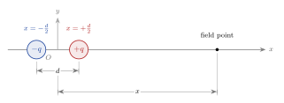

---
geometry:
- margin=1.25in
mainfont: Palatino
header-includes: 
- \usepackage[document]{ragged2e}
---

# Assignment 1

## Instructions
- PHY410: Do problems 1 and 2a-2b
- PHY 505: Do problems 1 and 2a-2c

Accept the assignment from "Classroom 50" website: <https://classroom50.org/ubsuny/compphys-fall26/assignments/assignment-1/accept>. This will create a new repository for you on github, titled something like `github.com/ubsuny/ubsuny/compphys-fall26-assignment-2-username`. The repository is located in the `ubsuny` github group, but it is your personal repository, and only you can view it. (The repository is actually not a fork, but rather a brand new repository created by directly copying files from a "template repository.)

The assignment requires two uploads:

1. **Submit a writeup/lab report to UBLearns.** The writeup should contain your complete solutions to the problems in writing. Feel free to use any format: latex, markdown, etc. For assignments using Jupyter notebooks, you can also do your writeup inside the notebook using Markdown cells, export the notebook to HTML/PDF/etc. (this may require some additional setup), and upload the exported notebook.
2. **Upload your code through Classroom 50.** This just means to `git push` any code you wrote to your GitHub repository. You can push as many times as you like before the due date (in fact, this is a good idea, as it serves as a backup; nothing will be graded before the due date).

\newpage


## Problem 1
*25 points*

This problem explores the limitations of floating point numbers for a specific physics problem: the electric field of a static dipole. Consider the following configuration, where a charge of $+q$ is placed at $(d/2, 0)$ and a charge $-q$ is placed at $(-d/2, 0)$:

{alt-text="Diagram of a dipole with a charge +q at (d/2, 0) and a charge -q at (-d/2, 0). The electric field is measured at a point along the x-axis."}

At a point along the $x$-axis, the electric field is given by:

$$
E_{\rm{exact}}(x) = E_+ - E_- = \frac{q}{(x-d/2)^2} - \frac{q}{(x+d/2)^2}. 
$$

For $x \gg d$, i.e. far away from the dipole, we can approximate this as:

$$
E_{\rm{approx}} = \frac{2qd}{x^3}.
$$


### Problem 1a
*10 points*

We will fix $x=1\,\text{m}$ and $q=1$, and let $d$ vary. Before programming anything, let's estimate the values of $d$ where we expect to see floating point problems. Recall that floating point numbers have a fixed number of bits for the mantissa/significand (e.g. 23 bits for a float, 52 bits for a double); any additional significant figures are lost, rounding to the nearest available floating point number. This is potentially a big problem for *subtraction* operations, like $E_{\rm{exact}}=E_{+}-E_{-}$: at minimum, we tend to lose significant figures, and in the worse case, the result can be smaller than the floating point error. 

You can roughly think of this truncation as an *relative uncertainty*, $\epsilon$. For example, if we restricted ourselves to only 2 significant figures, we can express numbers such as 1.0, 1.1, 1.2, ..., 10., 11., 12., ..., 100., 110., 120., etc. If we try to put 1.0499 into such a float, it will be rounded down to 1.0, which corresponds to a 5% error. Thus, for a 2-digit float, 5% is an upper bound on the the uncertainty introduced by truncation.

In a real C++ program, the `<limits>` library provides `std::numeric_limits<T>::epsilon()`, a templated function that returns an upper bound on the relative uncertainty for type `T` (here, type `T` is either a `float` or a `double`) [^1]. For a number `float x`, we can roughly say that `x` has an uncertainty, `dx`, given by `float dx = x * std::numeric_limits<T>::epsilon()` [^2]. 

[^1]: Specifically, `std::numeric_limits<T>::epsilon()` returns the gap between 1.0 and the next highest number. 

[^2]: Again, this is fairly rough: `epsilon` is a conservative upper bound on what we would actually consider the uncertainty, but we are just doing an order-of-magnitude estimate.

**Using propagation of uncertainty, estimate the value of $d$ for which $E_{\rm{exact}} \approx dE_{\rm{exact}}$, for both floats and doubles.** Specifically, starting from $E_{\rm{exact}}=E_{+} - E_{-}$, we have $dE_{\pm} = \epsilon E_{\pm}$. Use propagation of uncertainty to determine $dE_{\rm{exact}}$, set $E_{\rm{exact}}=dE_{\rm{exact}}$ to find the minimum $E$, and then solve for $d$. Use $\epsilon=1.19209\times 10^{-7}$ for floats and $\epsilon=2.22045\times 10^{-16}$ for doubles. 

In your write-up, please show your work for this calculation as well as the result.


### Problem 1b
*15 points*

Next, let's demonstrate the floating point limit in a real program. The file `problem1/problem1.cc` contains two template functions corresponding to $E_{\rm{exact}}$ and $E_{\rm{approx}}$ above. It explicitly instantiates `E_exact` for `float` and `double`, and `E_approx` for `double` (we could also instantiate `E_approx` with `float`, but the results will be very close to `double`, so we won't bother). The example code demonstrates how to compare the three functions for a value of `d=0.01`. The result is:

```
E_exact<double>(0.01)   = 0.020001
E_exact<float>(0.01)    = 0.0200011	Rel. diff. = 5.66858e-06
E_approx<double>(0.01)  = 0.02		Rel. diff. = -4.99994e-05
```

The relative difference (`Rel. diff.`) is calculated using `E_exact<double>` as a reference. Both `E_exact<float>` and `E_approx<double>` are pretty close to `E_exact<double>`, indicating that both are doing a reasonable job for `d=0.01`. However, note that we can already see floating point errors start to creep in.

**Modify problem1.cc to compare the values of `float E_exact`, `double E_exact`, and `double E_approx` for `d` values of 1.0, 0.1, 1.e-2, 1.e-3, ..., 1.e-12.** You should see the relative differences become large for certain values of `d`. In your write-up, include the output of the program (a table is fine; a log-scale plot would be a better visualization but we haven't covered that in class yet), and explain any differences between the 3 functions. Does the program match your expectation from Problem 1a?

---


\newpage
## Problem 2
*25 points*

The **standard deviation**, $\sigma$, of a set of $N$ measurements, $\{x_0, x_1, ..., x_{N-1}\}$, is given by:

$$
\sigma^2 = \frac{1}{N-1} \sum_{i=0}^{N-1} \left(x_i - \langle x \rangle\right)^2
$$

where $\langle x \rangle$ is the mean of the $\{x_i\}$. Naively, implementing this formula in a program requires 2 `for` loops: one to compute the mean $\langle x \rangle$, and a second to compute the outer sum.

In `problem2/problem2.cc`, we define a base and derived class:

1. Base class `StdDevBase` is a pure virtual class. It defines the interface for a standard deviation calculator, but not the implementation. It provides a data loader common method, `LoadData(std::vector<float> data_in)`, for the derived classes, and specifies a virtual function, `virtual float get_stddev()=0`, to indicate that derived classes should implement this function (i.e. override).
2. Derived class `StdDev` implements the standard deviation formula, `float get_stddev()`, using the naive "2-pass" method. The first pass computes the mean, $\langle x \rangle = \frac{1}{N}\sum_{i=0}^{N-1} x_i$, and the second pass computes $\sum_{i=0}^{N-1} (x_i - \langle x \rangle)^2$. 

We also provide a function, `std::vector<float> GenerateData(unsigned int n, float mean, float sigma)`, to create a vector of random, gaussian-distributed numbers (don't worry about the details, we will cover this much later in the course). 

Finally, `int main()` function calls `GenerateData()`, then uses an instance of `StdDev` to compute the standard deviation. Since the random numbers are drawn from a gaussian distribution, the computed standard deviation should be nearly equal to the gaussian `sigma`. 

### Problem 2a
*15 points*

There is a classic "trick" to compute the standard deviation in one pass[^3]. With $\langle x \rangle = \sum_{i=0}^{N-1} x_i / N$, we simply rearrange the formula as follows:

[^3]: You might be familiar with the simpler formula for the biased standard deviation, $\sigma^2 = \frac{1}{N}\left(\langle x^2 \rangle - \langle x \rangle^2 \right)$.

$$
\begin{aligned}
\sigma^2 &= \frac{1}{N-1} \sum_{i=0}^{N-1} \left(x_i^2 - 2 x_i \langle x \rangle + \langle x \rangle^2 \right) \\
&= \frac{1}{N-1} \left[\left(\sum_{i=0}^{N-1} x_i^2\right) - 2 \left(\sum_{i=0}^{N-1} x_i\right) \langle x \rangle  + \left(\sum_{i=0}^{N-1} \langle x \rangle^2\right)  \right] \\
&= \frac{1}{N-1} \left[\left(\sum_{i=0}^{N-1} x_i^2\right) - \left(\sum_{i=0}^{N-1} x_i\right)^2/N  \right]
\end{aligned}
$$

With this formula, we can compute the standard deviation with only one `for` loop, in which we accumulate the sums for both $\sum_{i=0}^{N-1} x_i^2$ and $\sum_{i=0}^{N-1} x_i$. 

**Implement the one-pass formula** in a new derived class, `StdDevFast`, which derives from `StdDevBase`. You can start by copying the code for the `StdDev`, and just modify the `get_stddev()` function. 

In `int main()`, add a few lines to use the `StdDevFast` class to compute the standard deviation of the same vector of random numbers. In your write-up, just copy the output of the program, showing the standard deviation computed using the two derived classes.


### Problem 2b
*10 points*

Using the `StdDevFast` class from Problem 2a, let's try to quantify the performance difference. **Adapt the code from the example `CompPhys/ReviewCpp/BasicExamples/func_timing.cpp` to measure the performance of the two classes**. You should increase the size of the vector to observe a difference, if needed. Is the `StdDevFast` class actually faster? 


### Problem 2c
*10 points*

**PHY505 students only**

The standard deviation computation involves a subtraction, so we should once again be wary of floating point limitations. Further, the two classes implement the subtraction rather differently: the `StdDevFast` class only performs the subtraction once, but with potentially very large numbers (e.g. $\sum_{i=0}^{N-1} x_i^2$) with a small difference, exactly the case we need to worry about.

**Find some values of $N$ and the gaussian mean and width where the standard deviation computation breaks down**. You should be able to:

1. Find a case where `StdDev` works, but `StdDevFast` fails. 
2. Find a case where both `StdDev` and `StdDevFast` fail.

---
